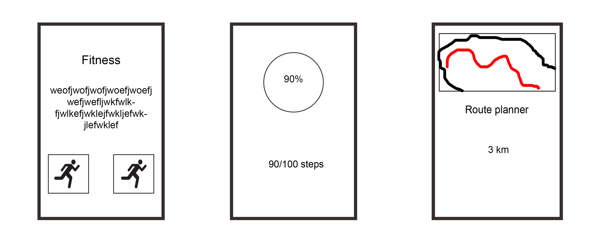

# programmerproject
Anh Nguyen
10771301

##Project Proposal
I want to build an app to make people get more fit. 
The app I want to build, should mainly consist of an exercise part, where the user can choose to run, or do other kind of exercises. Later on, if possible, I want to implement a food database too.

1.	This app will make it easier for a certain user to lose some weight or do some exercises. This will help the user getting a better lifestyle and to live a healthier life. This app will help the user get on a certain track with exercises.

	
2.	Some features I had in mind:
	- step counter
	- route planner (Google Maps) 
	- A way to collect data from an exercise database
	And maybe for later on:  a part of the app where information about food can be obtained.

3.	 
4.	A database to fetch data from, like information about exercises and more. The google maps API.
5.	There is a home screen, where all the parts of the application can be navigated to. Every button of the home screen has their own function, mainly navigational. For example, 1 button leads to a step counter, another one will create an workout schedule.

6.	An API containing information about exercises, and the google maps API
7.	I am not sure yet, but I think that implementing google maps will be a hard part. Maybe the use of sensors of the mobile devices will cause difficulties too.
8.	There are many fitness apps on the market, but they mainly consist of only one category, like a step counter, or an app that stimulates exercises. The basic fitness mainly contains of exercises an user can do, and sometimes a reminder to keep the user motivated, or remind the user. 
